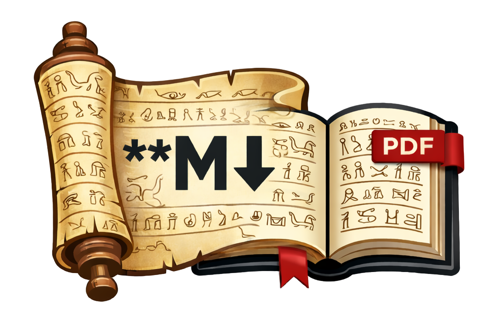

# Papyrus



A Rust tool that helps you write eBooks in markdown and convert to PDF, EPUB and HTML.

This is a port of [ibis-next](https://github.com/Hi-Folks/ibis-next) from PHP to Rust, providing better performance and a single binary distribution.

## Features

- 📝 Write your book in Markdown
- 📄 Generate PDF eBooks (with light/dark themes)
- 📱 Generate EPUB eBooks
- 🌐 Generate HTML eBooks
- 🎨 Customizable themes and styling
- 💻 Syntax highlighting for code blocks
- 📋 Frontmatter support for metadata
- 🖼️ Support for custom fonts, images, and cover pages

## Installation

### From Source

```bash
git clone https://github.com/milon/papyrus
cd papyrus
cargo build --release
```

The binary will be available at `target/release/papyrus`.

### Using Cargo

```bash
cargo install papyrus
```

## Quick Start

### Initialize a New Book

```bash
papyrus init
```

This creates the following structure:
```
.
├── papyrus.toml      # Configuration file
├── content/          # Your markdown files
│   └── 01-introduction.md
├── assets/
│   ├── fonts/        # Custom fonts
│   ├── images/       # Images and cover
│   ├── theme-light.html
│   ├── theme-dark.html
│   ├── theme-html.html
│   └── style.css
└── export/           # Generated files
```

### Generate PDF

```bash
# Generate PDF with light theme (default)
papyrus pdf

# Generate PDF with dark theme
papyrus pdf dark

# Use custom content directory
papyrus pdf --content ./my-content

# Use custom book directory
papyrus pdf --book-dir ./my-book
```

### Generate EPUB

```bash
papyrus epub
```

### Generate HTML

```bash
papyrus html
```

## Configuration

Edit `papyrus.toml` to configure your book:

```toml
title = "My Book"
author = "Author Name"
language = "en"
version = "1.0.0"
cover = "cover.jpg"  # Optional: path relative to assets/images/

# Optional: specify which markdown files to include
# If not specified, all .md files in content/ are included
md_file_list = [
    "01-introduction.md",
    "02-chapter-one.md",
]

# Optional: sample configuration
[sample]
start_page = 1
end_page = 10

# Optional: custom fonts
[[fonts]]
name = "CustomFont"
path = "fonts/custom-font.ttf"
```

## Markdown Files

### Frontmatter

You can add frontmatter to your markdown files:

```markdown
---
title: "Chapter Title"
author: "Author Name"
date: "2024-01-01"
---

# Chapter Content

Your markdown content here...
```

### File Organization

- Files are processed alphabetically by default
- Use `md_file_list` in config to specify order
- You can organize files in subdirectories within `content/`

## Themes

### PDF Themes

- `theme-light.html` - Light theme for PDF
- `theme-dark.html` - Dark theme for PDF

### HTML Theme

- `theme-html.html` - Template for HTML output

### Styling

- `style.css` - CSS styles used for EPUB and HTML output

Edit these files in the `assets/` directory to customize the appearance.

## PDF Generation

Papyrus supports multiple PDF backends (tries them in order):

1. **wkhtmltopdf** - Fast and reliable
2. **weasyprint** - Python-based, good CSS support
3. **Chrome/Chromium** - Headless browser rendering

Install at least one of these tools:

```bash
# macOS
brew install wkhtmltopdf

# Ubuntu/Debian
sudo apt-get install wkhtmltopdf

# Or use weasyprint
pip install weasyprint
```

## Syntax Highlighting

Code blocks are automatically syntax highlighted using [syntect](https://github.com/trishume/syntect), which supports many programming languages.

```markdown
```rust
fn main() {
    println!("Hello, world!");
}
```
```

## Commands

### `init [path]`

Initialize a new book project. Creates directory structure and sample files.

### `pdf [theme] [options]`

Generate a PDF eBook.

**Options:**
- `--content <path>` - Content directory (default: `./content`)
- `--book-dir <path>` - Book directory (default: `.`)

### `epub [options]`

Generate an EPUB eBook.

**Options:**
- `--content <path>` - Content directory (default: `./content`)
- `--book-dir <path>` - Book directory (default: `.`)

### `html [options]`

Generate an HTML eBook.

**Options:**
- `--content <path>` - Content directory (default: `./content`)
- `--book-dir <path>` - Book directory (default: `.`)

### `sample [theme]`

Generate a sample PDF (uses sample configuration from `papyrus.toml`).

### `config:migrate [--book-dir <path>]`

Migrate old ibis-next configuration files (PHP) to Papyrus format (TOML).

## Migration from ibis-next

If you're migrating from ibis-next:

1. Run `papyrus config:migrate` to attempt automatic migration
2. Review and update `papyrus.toml` manually if needed
3. Your markdown files should work as-is
4. Update theme files if you had custom themes

## Development

```bash
# Build
cargo build

# Run tests
cargo test

# Run with debug output
RUST_LOG=debug cargo run pdf
```

## License

MIT License - see LICENSE file for details.

## Credits

- Original [ibis-next](https://github.com/Hi-Folks/ibis-next) by Hi-Folks
- Original [ibis](https://github.com/themsaid/ibis) by Mohamed Said

## Contributing

Contributions are welcome! Please feel free to submit a Pull Request.
