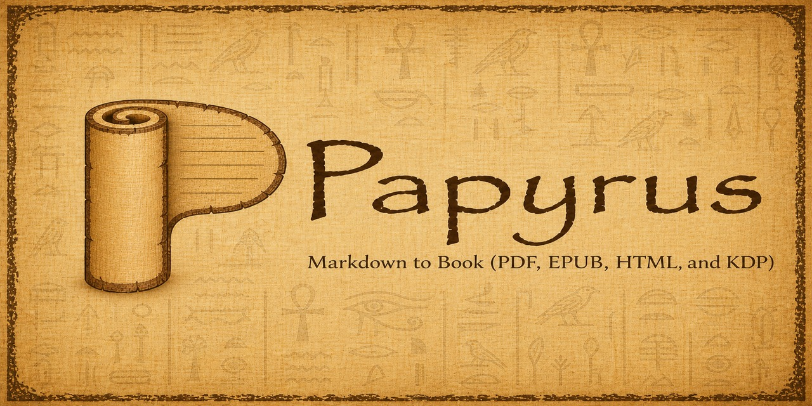

# Papyrus

<p align="center">
  
</p>

PHP CLI for Markdown book projects — PDF, EPUB, HTML, Hosted Site, and KDP exports.

Built from scratch with heavy influence from [ibis-next](https://github.com/Hi-Folks/ibis-next). Book projects use `papyrus.php`, `content/`, and `assets/`.

## Host your book as a website

`build:site` turns the same Markdown chapters into a multi-page static site you can deploy anywhere (GitHub Pages, Netlify, S3, …):

```bash
papyrus build:site
# → export/<slug>-site/
```

What you get:

- One HTML page per chapter, plus a Home index
- Chapter sidebar (collapsible on mobile)
- Light and dark mode (same palette as single-file HTML)
- Prev / Next navigation between chapters
- Shared `assets/site.css` and `assets/site.js` — no CDN required

Example — this repo’s handbook is hosted on GitHub Pages:

**[Browse The Papyrus Handbook](https://milon.im/papyrus)**

On push to `main`/`master`, [`.github/workflows/pages.yml`](.github/workflows/pages.yml) rebuilds
that site and publishes it to the `gh-pages` branch (custom domain: [milon.im/papyrus](https://milon.im/papyrus)).

```bash
papyrus build:site -d examples/the-papyrus-handbook -e docs
```

## Handbook

The sample book **The Papyrus Handbook** lives in [`examples/the-papyrus-handbook/`](examples/the-papyrus-handbook/). Read it online or from the prebuilt exports in `docs/`:

- [Site](https://milon.im/papyrus) — GitHub Pages (multi-page, sidebar, light/dark mode)
- [HTML](docs/the-papyrus-handbook.html) — single file, light/dark mode toggle
- [PDF](docs/the-papyrus-handbook-light.pdf)

Rebuild those exports with:

```bash
composer build:handbook
```

That runs `build:pdf`, `build:html`, and `build:site` with `-d examples/the-papyrus-handbook -e docs`.

## Requirements

- PHP 8.2+
- Composer
- PHP extensions: `dom`, `gd`, `mbstring`, `zip`, `zlib` (PDF via mPDF; EPUB packaging)
- Node: `@mermaid-js/mermaid-cli` (`mmdc`) when Mermaid diagrams are enabled

## Install

### Per project (recommended)

In your book repository:

```bash
composer require milon/papyrus
```

Then run via Composer’s binary path:

```bash
vendor/bin/papyrus --version
vendor/bin/papyrus init
```

Or add Composer scripts (example):

```json
{
  "scripts": {
    "build": "papyrus build",
    "build:pdf": "papyrus build:pdf --theme light,dark",
    "build:epub": "papyrus build:epub",
    "build:html": "papyrus build:html",
    "build:site": "papyrus build:site",
    "build:sample": "papyrus build:sample",
    "build:kdp": "papyrus kdp"
  }
}
```

```bash
composer build
composer build:site
```

### Global CLI

```bash
composer global require milon/papyrus
```

Ensure Composer’s global `bin` directory is on your `PATH` (typical locations: `~/.composer/vendor/bin` or `~/.config/composer/vendor/bin`):

```bash
export PATH="$(composer global config bin-dir --absolute):$PATH"
papyrus --version
papyrus list
```

### From this repository (development)

```bash
composer install
./bin/papyrus --version
./bin/papyrus list
```

## Quick start

Scaffold a new book in the current directory:

```bash
papyrus init
papyrus doctor
papyrus build:site
```

Or in a new folder:

```bash
mkdir my-book && papyrus init -d my-book
papyrus doctor -d my-book
papyrus build:site -d my-book
```

Open `export/<slug>-site/index.html` in a browser, or deploy that folder as a static site.

## Commands

| Command        | Description                                                           |
|----------------|-----------------------------------------------------------------------|
| `init`         | Scaffold `papyrus.php`, `content/`, `assets/`                         |
| `doctor`       | Validate config and project paths                                     |
| `build`        | Build all PDF themes, EPUB, HTML, and enabled KDP outputs             |
| `build:pdf`    | Build PDF themes (`--theme light,dark`, `--parallel` for multi-theme) |
| `build:site`   | Build multi-page HTML site with chapter sidebar (light/dark mode)     |
| `build:html`   | Build single-file HTML from `assets/theme-html.html` (light/dark mode) |
| `build:epub`   | Build EPUB3 with CSS and embedded images                              |
| `build:sample` | Build sample PDF from `sample.ranges` page ranges                     |
| `kdp`          | Build all enabled KDP outputs (eBook, print, cover, metadata)         |
| `kdp:ebook`    | KDP-ready Kindle EPUB (`export/<slug>-kdp.epub`)                      |
| `kdp:print`    | Print interior PDF with KDP margin/bleed presets                      |
| `kdp:cover`    | Export KDP cover assets to `export/`                                  |
| `kdp:metadata` | Emit KDP metadata sidecar JSON                                        |
| `sizes`        | List KDP page-size presets                                            |
| `migrate-ibis` | Migrate `ibis.php` to `papyrus.php` and update theme TOC markers      |
| `lint`         | Lint PHP code fences in `content/` (`--fix` to auto-fix)              |
| `watch`        | Rebuild on file changes (`--interval` seconds)                        |

Common options on book commands:

- `-d` / `--dir` — book root (default: current directory)
- `-e` / `--export` — override export directory (default: `<book>/export`)

Convert Markdown chapters programmatically:

```php
$project = Milon\Papyrus\Config\Project::load($bookDir);
$book = $project->bookConverter()->convertDirectory($project->contentDir);
```

## Tests

```bash
composer test
composer lint   # Pint
composer format # Pint --write
```

## License

MIT — see [LICENSE](LICENSE).
