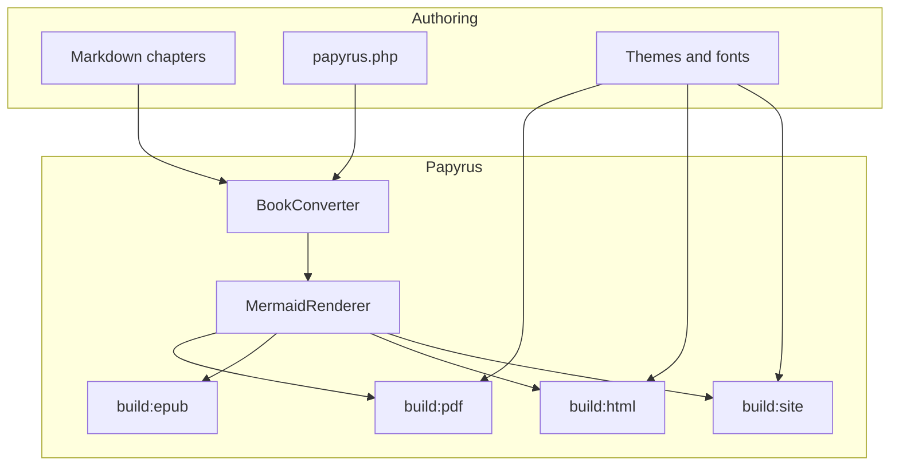

# Writing content

Chapters are Markdown under `content/`, loaded in natural filename order
(`00-…`, `01-…`, `10-…`).

## Front matter

````markdown
---
title: My chapter
pretoc: true
---

Body starts here.
````

| Key | Meaning |
|-----|---------|
| `title` | Chapter title for EPUB / site sidebar / running headers |
| `pretoc` | `true` places the chapter **before** the PDF table of contents |

Accepted truthy values for `pretoc`: `true`, `"true"`, `1`, `"1"`.

## Pretoc chapters

In the PDF, Papyrus splits the book into three bands around the theme’s TOC
marker (`<!-- PAPYRUS:TOC -->`):

1. **Pretoc** chapters (`pretoc: true`) — title page material, copyright,
   dedication, welcome, etc.
2. **Table of contents** — generated from body headings (see `toc` in config)
3. **Body** chapters — everything else, with folios and the running header

Pretoc chapters:

- Appear in EPUB, HTML, and the site like any other chapter
- Do **not** get normal body folios the same way (front matter styling)
- Are omitted from the auto-generated PDF TOC as body entries
- Still sort by filename — use a low prefix such as `00-` so they come first

This handbook’s Welcome page is the example:

````markdown
---
title: Welcome
pretoc: true
---

# Welcome

…
````

File: `content/00-welcome.md`. Introduction and later chapters omit `pretoc`
(or set it false) so they sit after the TOC in the PDF.

You can have several pretoc files (`00-copyright.md`, `00-dedication.md`,
`00-welcome.md`); all of them render before the TOC, in filename order.

## Markdown features

CommonMark + GFM, fenced code highlighting, and book extras.

### Emphasis and code

````markdown
Hello, **world**.

`inline code`

```php
$user = User::factory()->create();
```
````

### Callouts

```markdown
> {notice} Something helpful.
> {warning} Something risky.
```

```markdown
:::note
A note aside.
:::

:::warning
A warning aside.
:::
```

### Page breaks

```markdown
[break]
```

### Mermaid

Write a `mermaid` fence in your chapter. Papyrus runs `mmdc` at build time and
replaces the fence with an SVG (or PNG) figure in PDF, EPUB, HTML, and site
exports.

Source:

````markdown

````

Rendered output:


Enable in `papyrus.php` (theme defaults to `auto` — book colours; HTML and
site embeds both light and dark variants):

```php
'mermaid' => [
    'enabled' => true,
],
```

Optional knobs: `format` (`svg` / `png`), `theme` (`auto` or a Mermaid stock
theme like `default` / `dark` / `forest`), `max_width_mm`.

Requires `@mermaid-js/mermaid-cli` (`mmdc`) on `PATH`.
Diagrams cache under `.papyrus/cache/mermaid`.

## PHP fence linting

```bash
papyrus lint
papyrus lint --fix
papyrus lint --max-width=66
```

| Option | Short | Default | Meaning |
|--------|-------|---------|---------|
| `--fix` | `-f` | off | Apply auto-fixes for open tags and comment runs |
| `--max-width` | — | `66` | Maximum line width for PHP fences |
| `--dir` / `--export` | `-d` / `-e` | book defaults | Shared book options (`--export` unused for lint) |
