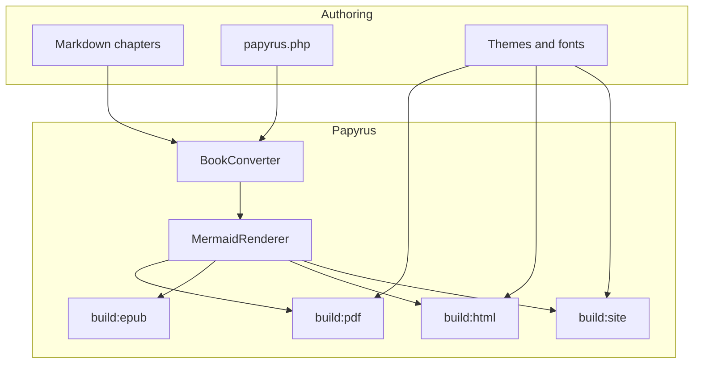

# Writing content

Chapters are Markdown under `content/`, loaded in natural filename order
(`00-…`, `01-…`, `10-…`).

## Front matter

````markdown
---
title: My chapter
pretoc: true
---

Body starts here.
````

| Key | Meaning |
|-----|---------|
| `title` | Chapter title for EPUB / internal use |
| `pretoc` | `true` places the chapter before the PDF TOC |

## Markdown features

CommonMark + GFM, fenced code highlighting, and book extras.

### Emphasis and code

````markdown
Hello, **world**.

`inline code`

```php
$user = User::factory()->create();
```
````

### Callouts

```markdown
> {notice} Something helpful.
> {warning} Something risky.
```

```markdown
:::note
A note aside.
:::

:::warning
A warning aside.
:::
```

### Page breaks

```markdown
[break]
```

### Mermaid

Write a `mermaid` fence in your chapter. Papyrus runs `mmdc` at build time and
replaces the fence with an SVG (or PNG) figure in PDF, EPUB, HTML, and site
exports.

Source:

````markdown

````

Rendered output:


Enable in `papyrus.php` (theme defaults to `auto` — book colours; HTML and
site embeds both light and dark variants):

```php
'mermaid' => [
    'enabled' => true,
],
```

Optional knobs: `format` (`svg` / `png`), `theme` (`auto` or a Mermaid stock
theme like `default` / `dark` / `forest`), `max_width_mm`.

Requires `@mermaid-js/mermaid-cli` (`mmdc`) on `PATH`.
Diagrams cache under `.papyrus/cache/mermaid`.

## PHP fence linting

```bash
papyrus lint
papyrus lint --fix
```
