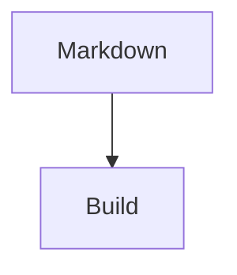

# Writing content

Chapters are Markdown under `content/`, loaded in natural filename order
(`00-…`, `01-…`, `10-…`).

## Front matter

````markdown
---
title: My chapter
pretoc: true
---

Body starts here.
````

| Key | Meaning |
|-----|---------|
| `title` | Chapter title for EPUB / internal use |
| `pretoc` | `true` places the chapter before the PDF TOC |

## Markdown features

CommonMark + GFM, fenced code highlighting, and book extras.

### Emphasis and code

````markdown
Hello, **world**.

`inline code`

```php
$user = User::factory()->create();
```
````

### Callouts

```markdown
> {notice} Something helpful.
> {warning} Something risky.
```

```markdown
:::note
A note aside.
:::

:::warning
A warning aside.
:::
```

### Page breaks

```markdown
[break]
```

### Mermaid

````markdown

````

Enable in `papyrus.php`:

```php
'mermaid' => [
    'enabled' => true,
    'format' => 'svg',
    'theme' => 'auto',
    'max_width_mm' => 130,
],
```

Requires `mmdc` on `PATH`. Diagrams cache under `.papyrus/cache/mermaid`.

## PHP fence linting

```bash
papyrus lint
papyrus lint --fix
```
